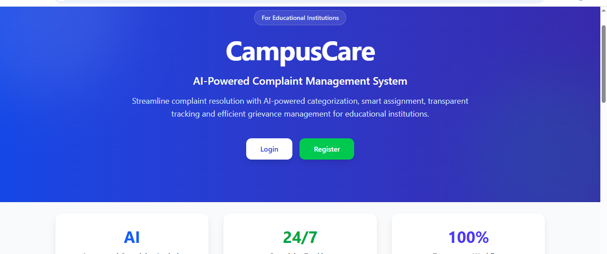
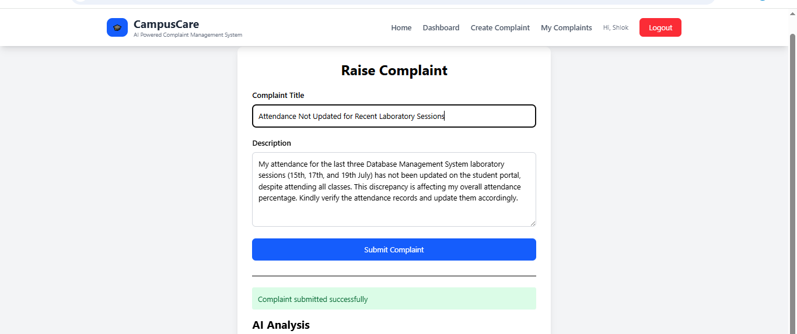
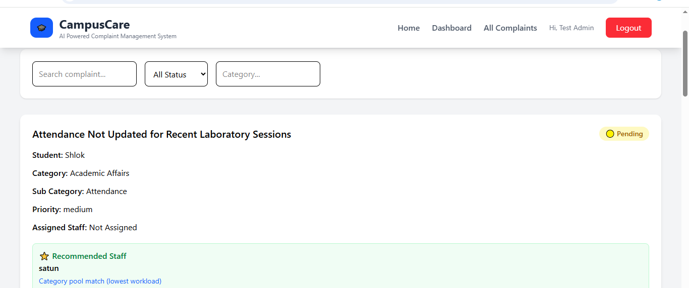
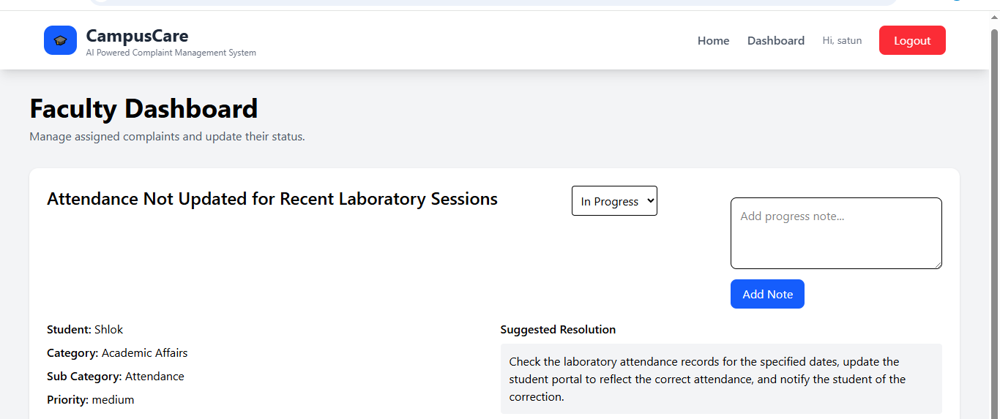
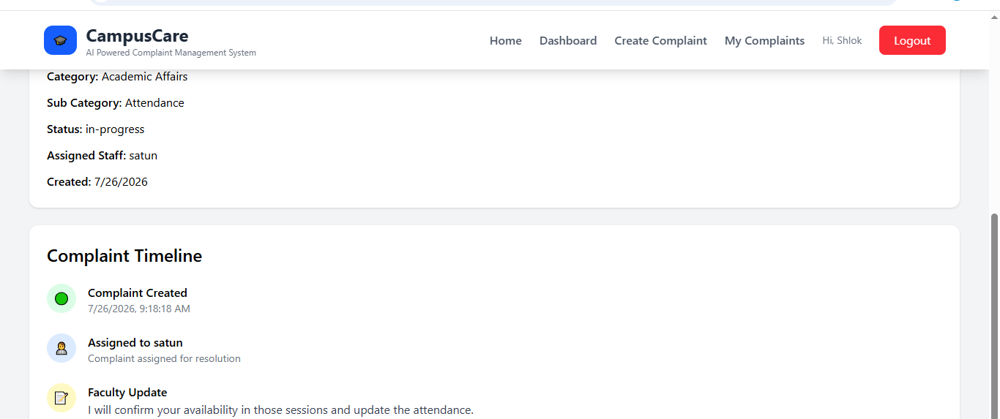

# 🎓 CampusCare — AI Complaint Routing System

**A full-stack, role-based complaint management system that reads a student's complaint, understands what it's actually about, and routes it to the right staff member automatically.**

[Features](#-features) • [Tech Stack](#-tech-stack) • [Getting Started](#-getting-started) • [API Reference](#-api-reference) • [Architecture](#-architecture) • [Security](#-security) • [Roadmap](#-roadmap)

🔗 **Live:** Frontend on Vercel · Backend on Render
📦 **Repo:** [github.com/vaishnavi11-tech/campuscare-ai-](https://github.com/vaishnavi11-tech/campuscare-ai-)

---

## 🧠 What is CampusCare?

CampusCare is a role-based (student / faculty / admin) complaint portal where routing isn't manual. What makes it different from a standard complaint tracker:

- **It understands the complaint, not just keywords.** Every complaint is embedded with Cohere's `embed-english-v3.0` model and matched against known categories using MongoDB Atlas `$vectorSearch`.
- **It escalates to an LLM when unsure.** Low-confidence matches get classified by a Groq-hosted model across 8 domains instead of falling into a generic bucket.
- **It recommends who should handle it.** A seven-step recommendation engine scores staff by authority, sub-expertise, similar-complaint history, resolver history, and current workload — not round-robin assignment.
- **It's role-aware end to end.** Students, faculty, and admins each see only what's relevant to them, enforced via JWT + role middleware.

---

## 📸 Screenshots

**Landing page**


**Student submits a complaint → AI analysis runs instantly**


**Admin view — recommendation engine suggests the best-fit staff member**


**Faculty dashboard — AI-suggested resolution guides the response**


**Full complaint lifecycle, tracked end to end**


---

## ✨ Features

| Feature | Description |
|---|---|
| 🤖 **Semantic Routing** | Cohere `embed-english-v3.0` embeddings + MongoDB Atlas `$vectorSearch` match complaints to categories without an LLM call in the common case |
| 🧭 **LLM Fallback Classification** | Ambiguous complaints get classified across 8 domains via a Groq-hosted model with structured JSON output |
| 👥 **Staff Recommendation Engine** | Seven-step scoring chain: candidate pool → direct authority routing → sub-expertise filter → similar-complaint retrieval → resolver history → workload ranking → final score |
| 📊 **Workload Awareness** | Admins can view staff workload by department before assigning |
| 🗂 **Full Complaint Lifecycle** | Create → assign → status update → notes → resolution, tracked per complaint |
| 🔐 **Role-Based Access** | Separate permissions for students, faculty, and admins via JWT + role middleware |
| 📈 **Stats Dashboards** | Personal, assigned, and system-wide complaint statistics |
| 📝 **Notes Thread** | Shared notes can be added to any complaint by authorized roles |

---

## 🛠 Tech Stack

### Backend

| Technology | Purpose |
|---|---|
| **Node.js / Express** | REST API framework |
| **MongoDB Atlas** | Database + vector search for semantic routing |
| **JWT** | Authentication |
| **Role middleware** | `isAdmin` / `isFaculty` / `isStudent` route guards |
| **Cohere (`embed-english-v3.0`)** | Complaint embeddings |
| **Groq** | LLM classification for low-confidence complaints |

### Frontend

| Technology | Purpose |
|---|---|
| **React** | Component-based UI |
| **Deployed on Vercel** | Frontend hosting |

---

## 🏗 Architecture

```
campuscare-ai-/
├── client/                        # React frontend
│   └── src/
│       ├── components/
│       ├── pages/
│       └── services/
├── server/                        # Express backend
│   ├── routes/
│   │   ├── authRoutes.js          # register, login, profile
│   │   ├── complaintRoutes.js     # create, assign, status, notes, stats
│   │   ├── userRoutes.js          # staff management, recommendation
│   │   └── aiRoutes.js            # embedding/classification analysis
│   ├── controllers/
│   ├── middleware/
│   │   ├── auth.js                # JWT verification
│   │   └── roleMiddleware.js      # isAdmin / isFaculty / isStudent
│   └── models/
└── README.md
```

### Data Flow

```
Complaint submitted
      │
      ▼
POST /complaints/create ──► auth + isStudent middleware
      │
      ▼
aiRoutes: /ai/analyze ──► Cohere embed-english-v3.0 ──► MongoDB Atlas $vectorSearch vs. known categories
      │
      ├── High similarity  ──► routed directly
      └── Low similarity   ──► Groq LLM classifies across 8 domains
      │
      ▼
recommend-staff/:category ──► seven-step recommendation engine
      │
      ▼
Complaint assigned ──► faculty updates status / adds notes ──► stats updated
```

---

## 🚀 Getting Started

### Prerequisites

- Node.js ≥ 18
- MongoDB (local or Atlas — vector search requires Atlas)
- API keys for **Cohere** and **Groq**

### 1. Clone the repository

```bash
git clone https://github.com/vaishnavi11-tech/campuscare-ai-.git
cd campuscare-ai-
```

### 2. Backend setup

```bash
cd server
npm install
```

### 3. Configure environment

Create `server/.env`:

```env
MONGO_URI=your_mongodb_connection_string
JWT_SECRET=your_jwt_secret
COHERE_API_KEY=your_cohere_api_key
GROQ_API_KEY=your_groq_api_key
PORT=5000
```

### 4. Frontend setup

```bash
cd ../client
npm install
```

### 5. Run locally

```bash
# Terminal 1 — backend
cd server
npm start

# Terminal 2 — frontend
cd client
npm start
```

Frontend runs at `http://localhost:3000`, API at `http://localhost:5000`.

---

## 📡 API Reference

> Routes shown here are relative to each router's mount path (e.g. `/api/auth`, `/api/complaints`) — confirm your exact prefixes in `app.js`/`server.js` if you want these updated.

### Auth Routes

| Method | Endpoint | Access | Description |
|---|---|---|---|
| `POST` | `/register` | Public | Register a new student |
| `POST` | `/login` | Public | Login, receive JWT |
| `GET` | `/profile` | Authenticated | Get current user's profile |

### Complaint Routes — Student

| Method | Endpoint | Access | Description |
|---|---|---|---|
| `POST` | `/create` | Student | Submit a new complaint |
| `GET` | `/my` | Student | Get complaints filed by current student |
| `GET` | `/my-stats` | Authenticated | Get personal complaint stats |

### Complaint Routes — Faculty

| Method | Endpoint | Access | Description |
|---|---|---|---|
| `GET` | `/assigned` | Faculty | Get complaints assigned to current faculty |
| `GET` | `/assigned-stats` | Faculty | Get stats for assigned complaints |
| `PATCH` | `/:id` | Faculty | Update a complaint's status |

### Complaint Routes — Admin

| Method | Endpoint | Access | Description |
|---|---|---|---|
| `GET` | `/all` | Admin | Get all complaints |
| `GET` | `/stats` | Admin | System-wide complaint statistics |
| `PATCH` | `/assign/:id` | Admin | Assign a complaint to staff |
| `DELETE` | `/delete/:id` | Admin | Delete a complaint |
| `GET` | `/recommend-staff/:complaintId` | Admin | Get staff recommendation for a complaint |

### Complaint Routes — Shared

| Method | Endpoint | Access | Description |
|---|---|---|---|
| `POST` | `/:id/note` | Authenticated | Add a note to a complaint |
| `GET` | `/:id` | Authenticated | Get a single complaint by ID |
| `GET` | `/test-embedding` | Dev only | Test embedding pipeline |

### Staff Routes

| Method | Endpoint | Access | Description |
|---|---|---|---|
| `GET` | `/staff` | Admin | Get all staff |
| `POST` | `/staff` | Admin | Create a staff member |
| `DELETE` | `/staff/:id` | Admin | Delete a staff member |
| `GET` | `/staff-workload/:department` | Admin | Get staff workload by department |
| `GET` | `/recommend-staff/:category` | Admin | Recommend staff for a category |

### AI Routes

| Method | Endpoint | Access | Description |
|---|---|---|---|
| `POST` | `/analyze` | Public | Run embedding + classification analysis on complaint text |

---

## 🔐 Security

- Passwords and sessions secured via **JWT authentication**
- Route-level access control via `isAdmin` / `isFaculty` / `isStudent` middleware
- Role separation enforced on every complaint and staff route — students, faculty, and admins each see only their scope
- Admin-only routes for staff management, assignment, and system-wide stats
- **Known trade-off:** JWT is stored in `localStorage` on the client, which is simple to implement but exposes the token to XSS if the frontend is ever compromised. A production hardening step would be moving to an HttpOnly cookie or adding a short-lived access token + refresh token pattern.

---

## 🗺 Roadmap

- [ ] SLA-based escalation (priority-driven, day-based thresholds) — scoped, not yet implemented
- [ ] Expand domain classification beyond 8 categories
- [ ] Staff-side analytics dashboard
- [ ] Admin controls for tuning similarity thresholds

---
